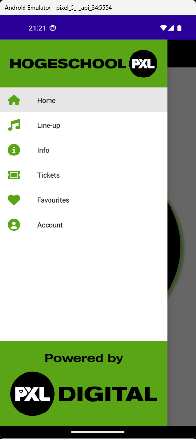
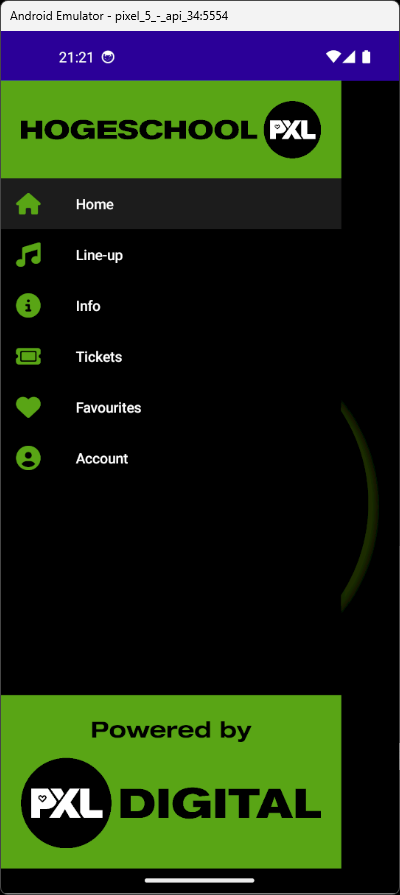
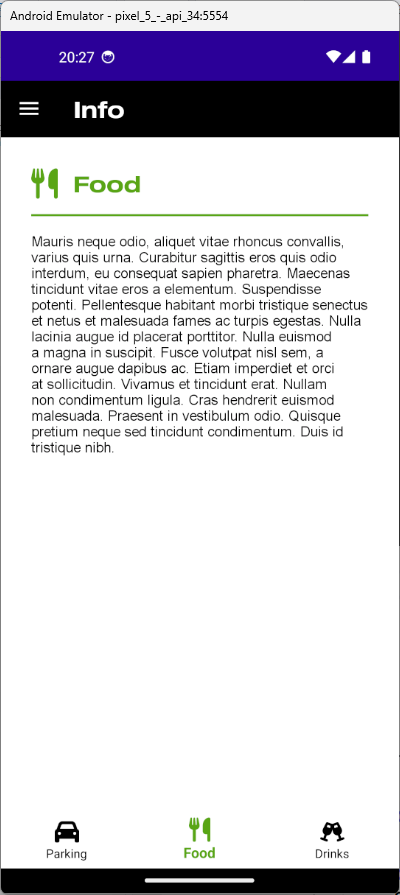
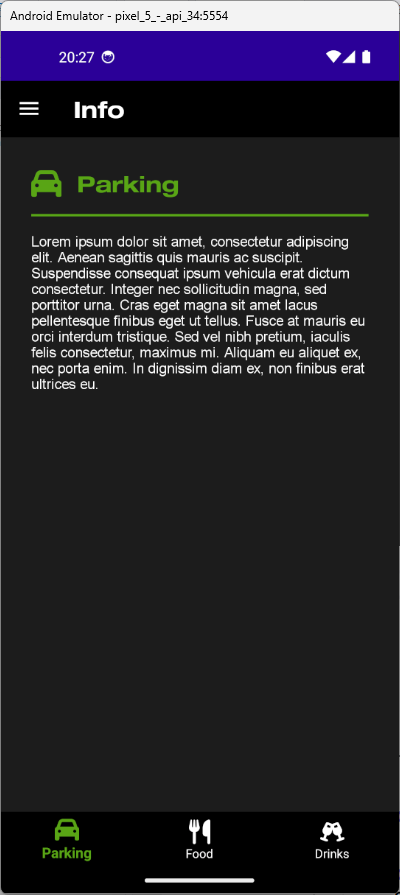
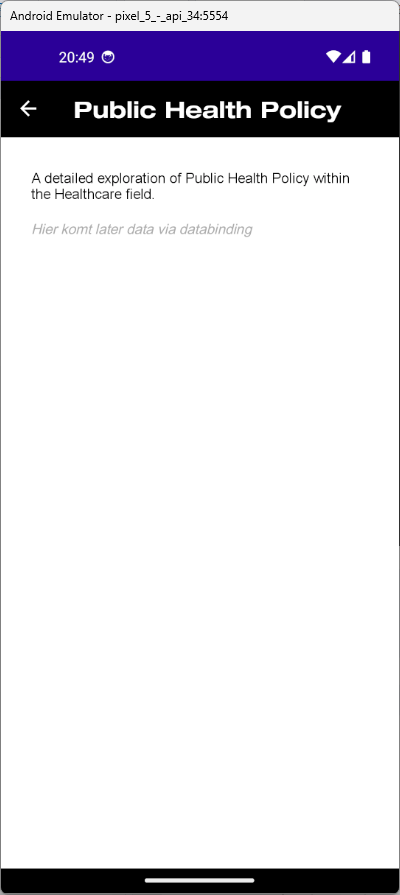

# PxlPop
## Intro
In de [vorige opdracht](https://classroom.github.com/a/p6fqBomf) werden de nodige CollectionViews en een TableView geïmplementeerd. In deze opdracht zullen Shell navigatie toevoegen via een Flyout en tabs.

## AppShell
- Vervang de Buttons in de MainPage door een Flyout
- Voeg zowel een FlyoutHeader als een FlyoutFooter toe
- Zorg voor een correcte opmaak door gebruik te maken van Styles

## InfoPage
- Vervang de InfoPage door 3 aparte ContentPages: InfoParkingPage, InfoFoodPage en InfoDrinksPage
- Gebruik de inhoud van de InfoPage om de nieuwe ContentPages te vullen
- Zorg dat de nieuwe ContentPages bereikbaar zijn via Tabs

## MainPage
- Verberg de bestaande Buttons

## LessonPage
- Maak een nieuwe ContentPage aan: LessonPage
- Voeg een Label toe: descriptionLabel
- Zorg dat de *name* eigenschap van een Lesson object wordt getoond als titel van de pagina
- Zorg dat de *description* eigenschap van een Lesson object wordt getoond in de descriptionLabel
- Navigeer naar de LessonPage wanneer een Lesson object wordt geselecteerd in de CollectionView, gebruik hiervoor de TapGestureRecognizer
- Zorg dat het juiste *Lesson* object wordt doorgegeven aan de LessonPage

