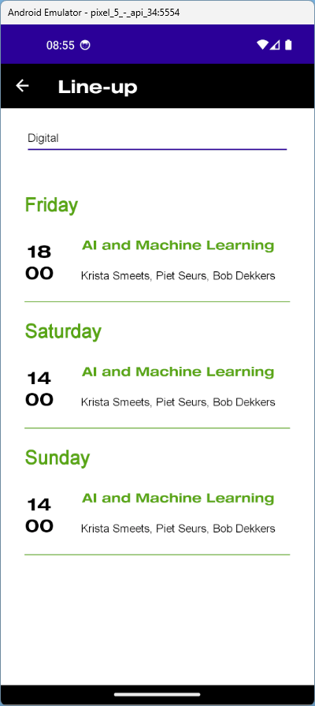
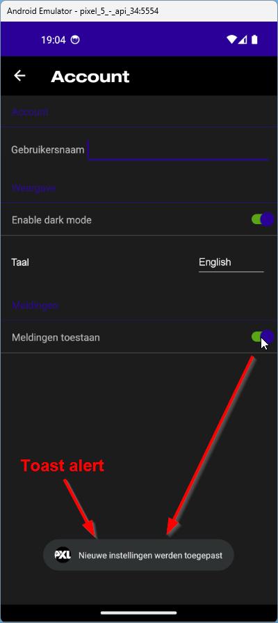

# PxlPop
## Intro
In de [vorige opdracht](https://classroom.github.com/a/1UMrXFEg) werden de verschillende *ContentPages* van de nodige *Views* voorzien. In dit deel zullen we de applicatie voorzien van een *CollectionView* en een *TableView*

Optioneel kan je een tweede CollectionView toevoegen aan de *FavouritesPage*.

## LineupPage
- Voeg een *CollectionView* toe aan de *LineupPage* 
- Gebruik de ```LessonData.GenerateLessonsAsync()``` om de data voor de line-up op te halen
- Implementeer een filter om de lessen per departement te tonen, maak gebruik van de bestaande *Picker* in de *LineupPage
- Sorteer de lessen per dag op startuur
- Voorzie een [*ActivityIndicator*](https://learn.microsoft.com/en-us/dotnet/maui/user-interface/controls/activityindicator) om te tonen terwijl de data geladen wordt
- Toon voor elk item:
    - het startuur (maak hiervoor gebruik van [String formatting](https://learn.microsoft.com/en-us/dotnet/maui/fundamentals/data-binding/string-formatting))
    - de naam van de les 
    - de namen van de sprekers (property *Lecturers*)

### Extra
- Voeg voor elk item een [tap gesture](https://learn.microsoft.com/en-us/dotnet/maui/fundamentals/gestures/tap) toe. Zorg dat de *Description* property als popup wordt weergegeven wanneer de gebruiker 2 keer tapped op een item.
- Gerbuik [grouped data](https://learn.microsoft.com/en-us/dotnet/maui/user-interface/controls/collectionview/grouping?view=net-maui-8.0) om de lessen weer te geven per dag
- Werk met [alternating rows](https://blog.verslu.is/stackoverflow-answers/alternate-row-color-listview/)

- 

## AcountPage
- Vervang de bestaande LayoutView door een TableView
- Maak een eerste *TableSection* met de tekst *Account*
- Voeg aan deze sectie een EntryCell toe met het Label *Gebruikersnaam*
- Voorzie een *TableSection* met de titel *Weergave*
- Gebruik een SwitchCell om de bestaande Switch voor *dark mode* te vervangen, zorg dat de functionaliteit behouden blijft
- Voeg in dezelfde section een ViewCell toe met een *Label* en een *Picker* waarmee de gebruiker de gewenste taal kan selecteren. (Nederlands of English)
- Voeg een tweede *TableSection* toe met de titel *Meldingen*
- Voeg aan deze sectie opnieuw een SwitchCell toe *Meldingen toestaan*
- Toon een [Toast alert](https://learn.microsoft.com/en-us/dotnet/communitytoolkit/maui/alerts/toast) elke keer als deze Switch aan of uit gezet wordt

> Later in de cursus leren we hoe we deze instellingen lokaal kunnen bewaren



## Lineup data
Als je verder werkt aan de repository van de vorige opgave (Views & Styles) zal je data nodig hebben om de line-up te kunnen tonen.
Maak hiervoor een statische klasse *Data\LessonData* aan met onderstaande functie:
```
public static async Task<List<Lesson>> GenerateLessonsAsync()
{
    List<Lesson> lessons = new List<Lesson>();
    Random random = new Random();

    // Event start times for each day
    DateTime fridayStart = new DateTime(2024, 10, 4, 18, 0, 0); // Friday 6 PM
    DateTime saturdayStart = new DateTime(2024, 10, 5, 14, 0, 0); // Saturday 2 PM
    DateTime sundayStart = new DateTime(2024, 10, 6, 14, 0, 0); // Sunday 2 PM

    // Durations for lessons
        TimeSpan[] durations = {
        TimeSpan.FromMinutes(30), TimeSpan.FromMinutes(45), TimeSpan.FromMinutes(60),
        TimeSpan.FromMinutes(75), TimeSpan.FromMinutes(90)
    };

    string[] departments = {
        "Business", "Education", "Healthcare", "Digital", "Media & Tourism",
        "People & Society", "Green & Tech", "Music", "MAD"
    };

    // Lesson topics and real lecturers based on PXL data
    string[][] lessonTopics = {
        new string[] { "AI in Business", "Leadership Strategies", "Financial Forecasting", "Marketing Trends", "Business Analytics", "Supply Chain Management", "Entrepreneurship", "Corporate Governance", "E-commerce Strategies", "Project Management" },
        new string[] { "Innovative Teaching", "Classroom Technology", "Curriculum Design", "Inclusive Education", "Student Engagement", "Early Childhood Education", "E-learning Platforms", "Teacher Development", "Assessment Techniques", "Online Learning Communities" },
        new string[] { "Telemedicine", "Robotic Surgery", "Mental Health", "Healthcare AI", "Public Health Policies", "Medical Ethics", "Patient Data Security", "Genomics", "Nutrition and Wellness", "Epidemiology" },
        new string[] { "Cloud Computing", "Cybersecurity", "Blockchain Basics", "Data Science", "Augmented Reality", "Artificial Intelligence", "Digital Transformation", "IoT Applications", "Software Development", "User Experience Design" },
        new string[] { "Social Media Marketing", "Influencer Culture", "Content Creation", "Travel Blogging", "Digital Travel Guides", "Tourism and Virtual Reality", "Event Management", "Public Relations", "Sustainable Tourism", "Marketing Analytics" },
        new string[] { "Social Activism", "Cultural Diversity", "Community Development", "Gender Equality", "Human Rights Advocacy", "Social Media Influence", "Poverty Alleviation", "Public Policy", "Mental Health Awareness", "Youth Empowerment" },
        new string[] { "Solar Energy", "Electric Vehicles", "Green Architecture", "Sustainable Agriculture", "Water Conservation", "Circular Economy", "Carbon Footprint Reduction", "Recycling Technologies", "Renewable Resources", "Environmental Policies" },
        new string[] { "Classical Music", "Jazz Improvisation", "Film Scoring", "Digital Music Production", "Music Theory", "Composition Techniques", "Live Performance", "Recording Techniques", "Music History", "Sound Design" },
        new string[] { "Contemporary Art", "Graphic Design", "Fashion Design", "Film Direction", "Photography", "Abstract Expressionism", "Pop Art", "Street Art", "Digital Art", "Conceptual Art" }
    };

    string[][] lecturers = {
        new string[] { "Dr. Emily Davis", "Mr. Alan Moore", "Prof. Sarah Nguyen", "Ms. Fiona Harper" },
        new string[] { "Prof. Mark Roberts", "Ms. Sarah Taylor", "Mr. Daniel Carter", "Ms. Natalie Green" },
        new string[] { "Dr. Rachel Stewart", "Prof. Daniel O'Brien", "Ms. Claire Bennett", "Mr. Oliver Brown" },
        new string[] { "Bob Dekkers", "Piet Seurs", "Eli Prenten", "Krista Smeets" },
        new string[] { "Kevin Bormans", "Luc Rerren", "Monique Rutten", "Johan Vandebosch" }
    };

    // Starting time per day
    DateTime[] eventDates = { fridayStart, saturdayStart, sundayStart };
    DateTime currentLessonTime = fridayStart;

    // Generate 150 unique lessons
    for (int dayIndex = 0; dayIndex < eventDates.Length; dayIndex++)
    {
        currentLessonTime = eventDates[dayIndex]; // Reset time for each day

        for (int i = 0; i < 50; i++)
        {
            int deptIndex = random.Next(departments.Length);
            int topicIndex = i % lessonTopics[deptIndex].Length; // Ensure unique topic
            string lessonName = lessonTopics[deptIndex][topicIndex];
            TimeSpan lessonDuration = durations[random.Next(durations.Length)];
            string lecturer1 = lecturers[random.Next(lecturers.Length)][random.Next(lecturers[0].Length)];
            string lecturer2 = random.Next(2) == 0 ? $", {lecturers[random.Next(lecturers.Length)][random.Next(lecturers[0].Length)]}" : "";

            lessons.Add(new Lesson
            {
                Name = lessonName,
                Description = $"Explore the topic of {lessonName}, focusing on its application in {departments[deptIndex]}.",
                Lecturers = lecturer1 + lecturer2,
                Begin = currentLessonTime,
                Duration = lessonDuration,
                Department = departments[deptIndex]
            });

            // Update start time for the next lesson
            currentLessonTime = currentLessonTime.Add(lessonDuration);
            await Task.Delay(20);
        }
    }

    return lessons;
}
```